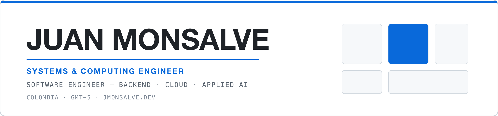
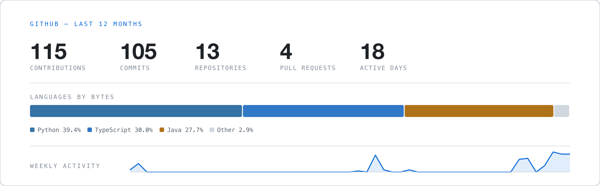

  <picture>
    <source media="(prefers-color-scheme: dark)" srcset="banner-dark.png">
    <source media="(prefers-color-scheme: light)" srcset="banner-light.png">
    
  </picture>

  📍 Colombia (GMT−5) &nbsp;·&nbsp; 🌐 <b><a href="https://jmonsalve.dev">jmonsalve.dev</a></b> (ES / EN)

I'm a Systems & Computing Engineer from Colombia. Most of my work is on the backend —
typed APIs, relational data models, and the deployment that carries them — and on applied
AI, where what interests me is less the model itself than deciding whether it belongs on the
critical path at all.

- 🔭 **Currently:** operating **EM Torneos** in production and looking for a backend or applied-AI role.
- 🧠 **Building:** **Apollo**, a local-first Spanish voice assistant.
- 🌱 **Next:** commercial LLM APIs in server-side workflows — inbound webhooks, structured extraction, and the cost and latency accounting that comes with them.
- 📫 **Reach me:** [JuanMonsalve.23@hotmail.com](mailto:JuanMonsalve.23@hotmail.com)

---

## 📈 GitHub

  <picture>
    <source media="(prefers-color-scheme: dark)" srcset="stats-dark.png">
    <source media="(prefers-color-scheme: light)" srcset="stats-light.png">
    
  </picture>

Generated from the GitHub API and refreshed daily — see <code>scripts/</code>.

---

## 💻 Tech stack

&nbsp;&nbsp;

&nbsp;&nbsp;

&nbsp;&nbsp;

&nbsp;&nbsp;

Applied AI day to day: Whisper, Ollama, sentence embeddings, ONNX Runtime and Pydantic schemas — the detail is in Apollo, below.

---

## 🏅 Certifications

Issued by Google Cloud, October 2024 — every badge links to its verification page on <a href="https://www.credly.com/users/juan-monsalve.1dfa7e0c">Credly</a>.

---

## 🛠️ Featured work

| Project | What it is | Stack |
|---|---|---|
| **[portfolio](https://github.com/Moonsalve/portfolio)** → [jmonsalve.dev](https://jmonsalve.dev) | My personal site, in Spanish and English. It's where these projects are explained properly, with the CV downloadable in either language. | Next.js 16 · TypeScript · GitHub Actions |
| **[asistente-local](https://github.com/Moonsalve/asistente-local)** | Apollo, a Spanish voice assistant that runs entirely on your own machine. For controlling a computer by voice without sending your audio to anyone. | Python · Whisper · Ollama · Pydantic |
| **[chat-servidor-java](https://github.com/Moonsalve/chat-servidor-java)** | A group chat server. Many people write at the same time and everyone still sees the messages in a consistent order. | Java · NIO · Concurrency |

**EM Torneos** is a league-management platform — an API plus a desktop client — that an amateur
football league uses daily to run tournaments, matches, payments and fines. It lives in two
private repositories; happy to walk through the architecture.

---

## 🌐 Connect

---

🎓 Systems &amp; Computing Engineering, Universidad Pontificia Bolivariana (2023–2026) · Spanish native, English C1+

